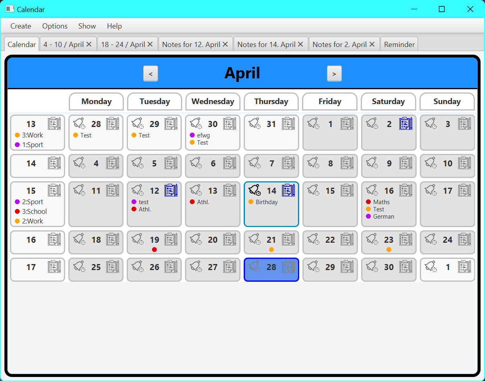
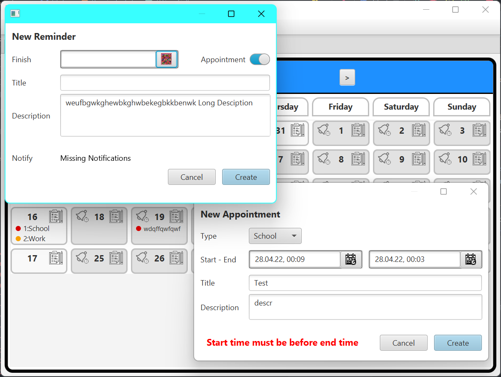

# Calendar

A desktop calendar written in [Kotlin](https://github.com/edvin/tornadofx) with [Tornadofx](https://github.com/edvin/tornadofx) with appointments, notes and reminders

## Features
### Overview
- Overview of all days in one month
- Buttons to quickly create reminder and notes for specific day
- Overview of all appointments for each day and whole week

### Appointments
- Each appointment has a specific type like school, work, sports, etc. 
- appointments can cover multiple days or weeks
- Appointment consists of a title a description

### Notes
- Notes can be created for specific day or week
- Each day/week can have one note for each type 
- Notes contain a complete texteditor to write rich text 

### Reminder
- Reminder can have an appointment as their deadline or a simple date
- Feature a title and a description like an appointment

## TODO
- Reminder without deadline
- Settingstab
  - Settings for different typs
  - Settings for Weekly Appointments
- Notifications
- Improved Reminder Overview
- Global notes
- Notes overview
- Global TODOs
